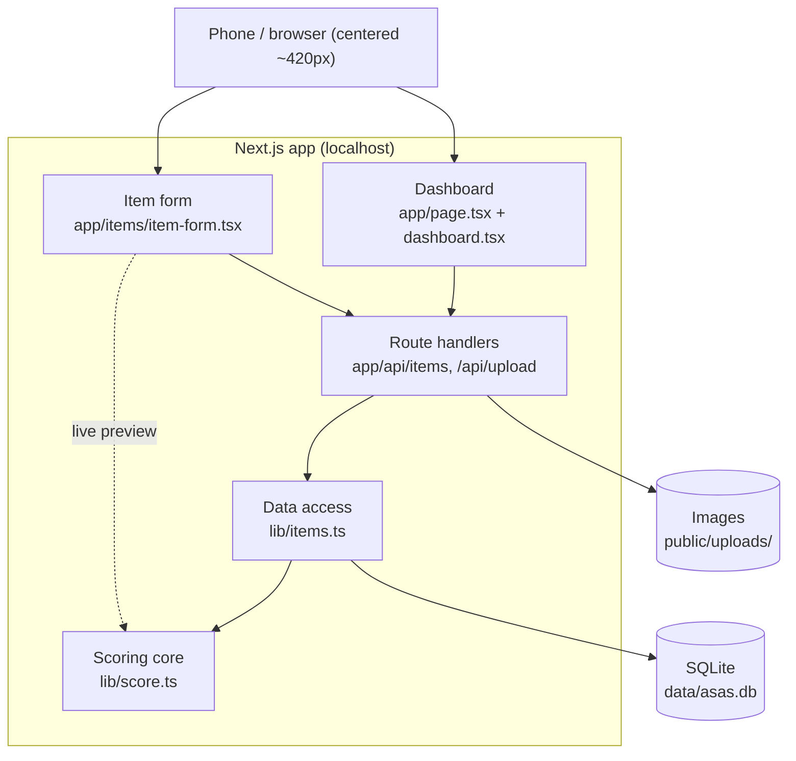

# Asas

**A minimalist decluttering app that scores your belongings so you know what to keep, what to ditch, and what to pack.**

Asas turns the endless "should I keep this?" question into a quick, repeatable decision. Photograph an item, answer five short questions rooted in proven decluttering frameworks, and get an instant **Keep Score** and a verdict — **Keep**, **Maybe**, or **Leave**. Built for a student deciding what to physically bring into a new academic year, but useful for anyone downsizing a room, a move, or a life.

---

## Overview

Most decluttering advice lives in books; the decision still happens in your head (or a messy spreadsheet). **Asas** is a small, self-hosted web app that makes the decision structured and fast.

It blends three well-known **minimalism and decluttering frameworks** into a single score:

- **The Minimalists** — the 90/90 rule (used recently? will you use it soon?) and the 20/20 rule (easily replaceable → safe to let go).
- **Marie Kondo / KonMari** — the emotional axis: does it still matter to you?
- **Fumio Sasaki (*Goodbye, Things*)** — negative signals like "kept only for appearance," and "can you talk about it with passion?" as a cleaner test than "does it spark joy."

Five questions feed a weighted **Keep Score (0–100)**, bucketed into Keep / Maybe / Leave, with a **sentimental veto** so nothing you truly cherish gets auto-discarded. A grid dashboard lets you filter your whole inventory by verdict *and* category, so "show me the electronics I'm leaving behind" is one tap.

**Keywords:** decluttering app, minimalist inventory, KonMari, The Minimalists 90/90 rule, self-hosted, Next.js, React, SQLite, Bun, personal belongings tracker, moving checklist, packing list, keep-or-toss.

**Tech:** Next.js (App Router) · React · TypeScript · SQLite (`better-sqlite3`) · Bun · Cal.com-inspired mobile-first UI. Runs entirely on your own machine — no accounts, no cloud, your data stays local.

---

## Visuals

> Screenshots live in `docs/screenshots/`. Drop your own PNGs/GIFs there and update the paths below.

| Dashboard | Reassess an item |
|---|---|
|  |  |

### Architecture



---

## Installation

Asas runs locally. There is no hosted version by design — it's your inventory, on your machine.

### Prerequisites

- **[Bun](https://bun.sh) 1.3+** (runtime, package manager, and test runner).
  - Arch/CachyOS: `sudo pacman -S bun` · macOS/Linux: `curl -fsSL https://bun.sh/install | bash`

### Standard user

```bash
git clone <repo-url> asas   # or download the source
cd asas
bun install
bun run dev
```

Open the URL printed in the terminal (usually **http://localhost:3000**, or the next free port such as `3003` if 3000 is taken). Your data is created on first use in `data/asas.db`; uploaded images go to `public/uploads/`. Both are gitignored — back them up if they matter.

### Developer

```bash
bun install
bun test           # run the scoring unit tests
bun run dev        # dev server with hot reload
bun run build      # production build
bun run start      # serve the production build
```

The one piece with real logic — the scoring — is covered by `lib/score.test.ts`. Run `bun test` after any change to `lib/score.ts`.

---

## Usage

1. **Add an item** — tap **+ Add item**, give it a name, optional brand, and category, and capture or upload a photo.
2. **Reassess** — answer the five questions. The Keep Score badge recolors live as you tap.
3. **Save** — the verdict (Keep / Maybe / Leave) is stored and shown as a colored dot on the grid.
4. **Filter** — narrow the grid by verdict (All / Keep / Maybe / Leave / New) and by category. Use the **Leave** filter as your get-rid-of list, **Keep** as your packing list.

### The scoring model

All weights and thresholds live in `lib/score.ts`:

| Question | Points |
|---|---|
| Will you use it in year 4? | no `0` / maybe `15` / yes `30` |
| Used in the last 90 days? | `0` / `20` |
| Can you talk about it with passion? | `0` / `20` |
| Kept only for looks / others? | yes `−15` |
| Easily replaceable (~20 min / ~$20)? | yes `−10` / no `+10` |

Raw score (range −25…80) is normalized to **0–100**: `round((raw + 25) / 105 * 100)`.

| Verdict | Score |
|---|---|
| 🟢 Keep | ≥ 60 |
| 🟡 Maybe | 35–59 |
| 🔴 Leave | < 35 |

**Sentimental veto:** flag an item as sentimental and a computed **Leave** becomes **Maybe** — the score is unchanged, but you never auto-discard something you cherish.

```ts
import { scoreItem } from "@/lib/score";

scoreItem({
  use_year4: "yes", used_90d: true, passion: true,
  for_looks: false, replaceable: false, sentimental: false,
});
// → { score: 100, verdict: "keep" }
```

---

## Contributing

Contributions are welcome — this started as a final-year project, so keep changes small and focused.

1. Read `CLAUDE.md` first — it's a compact map of the codebase (file responsibilities, the scoring model, how to run and verify).
2. Create a branch: `git checkout -b feature/your-thing`.
3. Follow the existing style: small typed functions, one responsibility per file, mobile-first UI using the CSS variables in `app/globals.css`.
4. If you touch scoring, update `lib/score.test.ts` and run `bun test`. If you add an item field or category, follow the worked patterns (`brand` column, `lib/categories.ts`).
5. Verify locally — SSR and API can be checked with `curl`, but live score, image upload, and the delete confirm need a real browser click-through.
6. Open a pull request describing **what changed and why**.

---

## Known issues & roadmap

**Known limitations**

- Single-user, single-device. Data lives in a local SQLite file with no sync or auth.
- Removing an image or deleting an item clears the database reference but leaves the orphaned file in `public/uploads/` (harmless, but not cleaned up).
- No export/import yet — clearing `data/` loses your inventory.

**Roadmap**

- [ ] JSON export / import (guard against data loss and move between machines)
- [ ] Dedicated results / summary page (counts, progress, grouped Keep/Leave lists)
- [ ] Packing-list export of all Keep items
- [ ] Bulk actions (reassess or delete multiple items)
- [ ] Optional disk cleanup for orphaned images

---

## License & credits

**License:** No license is set yet. Until one is added, treat this as a personal project — all rights reserved. If you intend to open it up, [MIT](https://choosealicense.com/licenses/mit/) is a sensible default; add a `LICENSE` file to make it official.

**Credits**

- Decluttering frameworks: **The Minimalists** (Joshua Fields Millburn & Ryan Nicodemus), **Marie Kondo** (KonMari), and **Fumio Sasaki** (*Goodbye, Things*).
- Visual language inspired by **[Cal.com](https://cal.com)** — clean white canvas, near-black CTAs, Inter typography.
- Built with **Next.js**, **React**, **SQLite** (`better-sqlite3`), and **Bun**.
